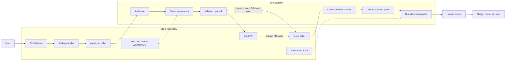

# dev-platform

`dev-platform` is a small, reusable implementation pipeline for private client
repositories. An authorized GitHub Issue becomes a Codex-generated draft pull
request; deterministic checks and the final decision stay human-owned.



V1 intentionally has no planning agent, AI reviewer, auto-merge, production
deployment, Terraform access, model routing, or orchestration service.

## Connect a client repository

Prerequisites:

- a private client repository with known build, test, lint, and typecheck commands;
- permission for that repository to call this private repository's workflows;
- GitHub Actions permission to create pull requests; and
- active OpenAI API billing with a small budget and usage alerts.

Install the five client files:

```bash
./client-setup install ../client-repository YOUR_ORG/dev-platform
```

Then:

1. Replace the guidance in `PROJECT.md` and `AGENTS.md` with confirmed project
   context and commands.
2. Run `./client-setup check ../client-repository`.
3. Create the `agent` label.
4. Add the `OPENAI_API_KEY` repository secret.
5. Set `AGENT_AUTHORIZED_ACTORS`, `PIPELINE_ENABLED=true`, and
   `AGENT_PIPELINE_ENABLED=true`.
6. Set the applicable `CI_BUILD_COMMAND`, `CI_TEST_COMMAND`,
   `CI_LINT_COMMAND`, and `CI_TYPECHECK_COMMAND` variables.

The installed callers use `@main`. `main` is the client release channel, so a
platform change must pass review and exact-SHA canary testing before merge.
The installer refuses existing files and symlinked destination directories; it
never configures GitHub or handles secrets.

See [Security and authentication](docs/security.md) for API-key isolation,
protected paths, permissions, and the future OIDC migration.

## Use it

1. Complete the Agent task Issue form.
2. Review the request, then add `agent` as an authorized user.
3. The pipeline records an attempt, runs Codex, and opens an
   `issue/<number>-attempt-<number>` draft PR.
4. CI appears on the PR and verifies its exact immutable commit.
5. Review the diff, CI, and any client-owned preview; merge, revise, or reject.

Remove and re-add `agent` to authorize another attempt. Attempts are serialized
per Issue, limited to three by default, and have finite timeouts.

When meaningful product or user-visible intent is missing, Codex comments
`HUMAN INPUT REQUIRED` with one question and creates no branch.

## Stop it

- One repository: set `PIPELINE_ENABLED=false`.
- Organization-owned portfolio: set `AGENT_PIPELINE_ENABLED=false` once at the
  organization level.
- Personal-account portfolio: set `AGENT_PIPELINE_ENABLED=false` in every
  connected repository.
- Emergency fallback: disable **Agent implementation** in GitHub Actions.

Cancel active runs separately. Rotate `OPENAI_API_KEY` if exposure is suspected.

## Safety boundaries

- Issue and PR text is untrusted data and is never inserted into shell source.
- Codex has repository-read access, no write token, and no production credential.
- A separate publishing job validates the patch before using its narrow write
  permissions to create a branch and draft PR.
- Infrastructure, workflow, project-context, and Terraform paths are protected
  before publication and again in CI.
- CI checks out the exact requested commit before running client-owned commands.
- Merging and production delivery remain human-owned.

## Maintain and release

Before considering a platform change complete:

```bash
./tests/run.sh
git diff --check
```

Then canary-test the exact candidate SHA before merging it to `main`. See
[Canary and release](docs/release.md) for the required cases, evidence, pins,
release steps, and rollback.
